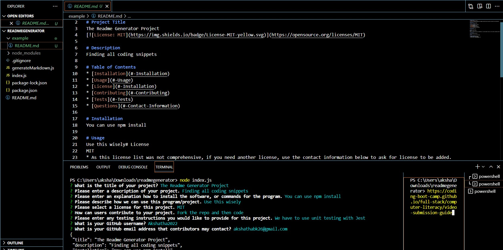

README Generator

User Story

AS A developer
I WANT a README generator
SO THAT I can quickly create a professional README for a new project

Acceptance Criteria

GIVEN a command-line application that accepts user input
WHEN I am prompted for information about my application repository
THEN a high-quality, professional README.md is generated with the title of my project and sections entitled Description, Table of Contents, Installation, Usage, License, Contributing, Tests, and Questions
WHEN I enter my project title
THEN this is displayed as the title of the README
WHEN I enter a description, installation instructions, usage information, contribution guidelines, and test instructions
THEN this information is added to the sections of the README entitled Description, Installation, Usage, Contributing, and Tests
WHEN I choose a license for my application from a list of options
THEN a badge for that license is added near the top of the README and a notice is added to the section of the README entitled License that explains which license the application is covered under
WHEN I enter my GitHub username
THEN this is added to the section of the README entitled Questions, with a link to my GitHub profile
WHEN I enter my email address
THEN this is added to the section of the README entitled Questions, with instructions on how to reach me with additional questions
WHEN I click on the links in the Table of Contents
THEN I am taken to the corresponding section of the README

Application Requirements

* Functional application.

* GitHub repository with a unique name and a README describing project.

* The generated README includes the following sections: 

  * Title
  * Description
  * Table of Contents
  * Installation
  * Usage
  * License
  * Contributing
  * Tests
  * Questions

Screenshot:

Because this is a command-line application won’t be deployed, here is a <a href="https://drive.google.com/file/d/1FtW24vCoW2UsxN7xRWCpu0h9h4mNkJ2U/view" target="_blank">Link</a> to a video walkthrough that demonstrates the functionality of my application.

Resources:

https://stackoverflow.com/questions/47083351/node-module-not-found

https://www.npmjs.com/package/generate-readme

https://www.npmjs.com/package/inquirer/v/8.2.4

https://coding-boot-camp.github.io/full-stack/github/professional-readme-guide

https://coding-boot-camp.github.io/full-stack/computer-literacy/video-submission-guide

GitHUb Link: https://github.com/Akshatha2022/readmegenerator

Video Walkthrough Link: <a href="https://drive.google.com/file/d/1FtW24vCoW2UsxN7xRWCpu0h9h4mNkJ2U/view">Link</a>
